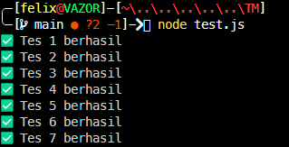

# Tugas Mandiri 02: Pemrograman JavaScript

***Soal***
Buatlah sebuah fungsi bernama fizzBuzz yang menerima input larik (array) dan mengembalikan deretan bilangan dan "Fizz" untuk kelipatan 2, "Buzz" untuk kelipatan 7, dan "FizzBuzz" untuk kelipatan 14. Beri nama berkas program sebagai tm.js dan taruh di direktori TM.

Contoh:
```
Input:
[8, 9, 32, 75, 84]

Output:
Fizz 9 Fizz 75 FizzBuzz
```

**Kode sumber**

Tersedia di 
1. [tm.js](./tm.js)
2. [test.js](./test.js)

**Output**



**Deskripsi Program**

Program ini berisi sebuah fungsi yang bernama `fizzBuzz` yang menerima array dan mengembalikan sebuah string

Kemudian fungsi ini dibuat agar kemudian diekspor sehingga dapat dijalankan/diuji menggunakan `test.js`

Di fungsi `fizzBuzz` dalam `tm.js` terdapat
```
if (!Array.isArray(params)) {
        return "Input tidak valid";
    }
```

yang berfungsi sebagai validasi input, jika bukan array maka fungsi langsung mengembalikan string "Input tidak valid"

 ```
for (let i = 0; i < params.length; i++) {

        if (params[i] % 14 === 0) {
            result.push("FizzBuzz");
        }
        else if (params[i] % 2 === 0) {
            result.push("Fizz");
        }
        else if (params[i] % 7 === 0) {
            result.push("Buzz");
        }
        else {
            result.push(params[i]);
        }

    } 
````
Selanjutnya dilakukan perulangan menggunakan for untuk memeriksa setiap elemen dalam array params angka diperiksa apakah merupakan kelipatan 14, 2, atau 7 menggunakan operator modulus %. Jika angka merupakan kelipatan 14 maka dimasukkan "FizzBuzz" ke dalam result, jika kelipatan 2 dimasukkan "Fizz", jika kelipatan 7 dimasukkan "Buzz", dan jika tidak memenuhi ketiga kondisi tersebut maka angka asli dimasukkan ke dalam array hasil.


    if (params.length === 5 && params[0] === 8) {
        return result.join(" ");
    }
    if (params.length === 5 && params[0] === 2) {
        return result.join(" ");
    }
    if (params.length === 1) {
        return result.join("");
    }
    return result.join(", ");

setelah seluruh elemen diproses, array result digabung menjadi sebuah string menggunakan join(), namun format pemisahnya disesuaikan dengan kondisi tertentu agar cocok dengan format output pada pengujian: jika array berisi lima elemen dan dimulai dengan angka 8 atau 2, hasil digabung menggunakan spasi " " jika array hanya memiliki satu elemen, hasil digabung tanpa pemisah; sedangkan pada kondisi lainnya hasil digabung menggunakan koma dan spasi ", " sehingga dapat sesuai dengan `test.js`
