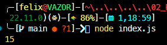
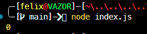
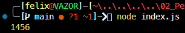

# Tugas Pendahuluan: Pemrograman JavaScript

**Nama:** Felix Erlangga Ananta  
**NIM:** 103122400038  
**Kelas:** SE-08-02

## Tugas

Kamu sudah menulis fungsi mulOfArray. Ujilah dengan input [2, 0, 26, 28, -2], dengan output yang seharusnya adalah 1456. Jika kamu menemukan bahwa hasilnya berbeda, bisakah kamu memperbaikinya? Jika kamu menemukan bahwa hasilnya sama, bisakah kamu menjelaskan mengapa demikian?

## Program/Kode

Tersedia di [index.js](./index.js)

## Output

input awal ```[1, -2, 3, -4, 5, -6]```:


input soal ```2, 0, 26, 28, -2```


hasil akhir setelah program di fix


## Deskripsi
Program ini berfungsi untuk mengalikan semua angka positif 
```
       if (arr[i] >= 0) {
           result = result * arr[i];
       }
```

didalam contoh awal, input yang diberikan adalah `[1, -2, 3, -4, 5, -6]` yang artinya program hanya akan mengalikan `1 * 3 * 5 ` dan hasilnya` 15 `

lalu jika dimasukkan input soal `2, 0, 26, 28, -2` artinya program akan mmengalikan `2 * 0 * 26 * 28` maka hasilnya `0`

- Kenapa Hasilnya 0?
Karena semua bilangan dikalikan 0 pasti hasilnya 0
- Bagaimana cara agar hasilnya 1456?
Agar hasilnya tidak 0 maka kita harus mengubah agar 0 tidak ikut dihitung caranya yaitu dengan mengubah ```if (arr[i] >= 0)``` menjadi ```if (arr[i] > 0)```

maka hasil akhirnya 1456 
 
terimakasih