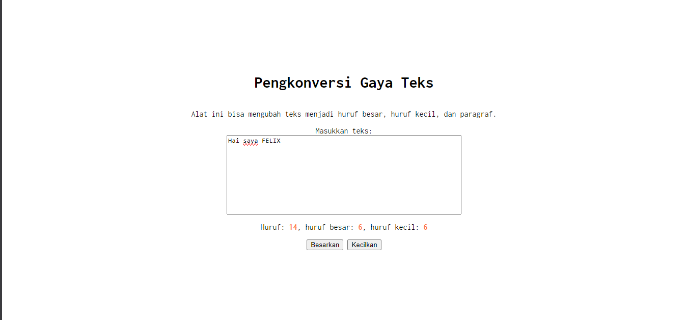

# Tugas Mandiri: GUI dengan HTML dan CSS

**Nama:** Felix Erlangga Ananta  
**NIM:** 103122400038  
**Kelas:** SE-08-02

## Tugas
Setelah kamu menyelesaikan tugas pendahuluan (bisa buka di atas), terapkanlah fungsi untuk (1) menghitung huruf kecil yang disediakan di #hk, (2) mengubah huruf kecil ke huruf besar ketika pengguna menekan tombol #huruf-besar, dan (3) mengubah huruf besar ke huruf kecil ketika pengguna menekan tombol #huruf-kecil.

Untuk nomor 2 dan 3, tampilkan hasilnya di dalam editor-kecil.

Kemudian, hapuslah fitur "Paragrafkan" dari alat.

## Program/Kode
Tersedia di 
[index.html](./index.html) 
[index.css](./index.css) 
[index.js](./index.js)

## Output


## Deskripsi

Jadi disini agar counter huruf(besar dan kecil) bekerja, saya perlu melakukan perubahan pada [index.js](./index.js)

dimana saya menginisialisasi beberapa variable baru seperti
```
const countHb = document.getElementById("hb");
const countHk = document.getElementById("hk");

const buttonHb = document.getElementById("huruf-besar");
const buttonHk = document.getElementById("huruf-kecil");
```

lalu agar rapi saya membungkus logika menghitung huruf yang sebelumnya di TP menjadi sebuah fungsi yaitu
```
function updateCharCount(text) {
    charCountElement.textContent = text.length;

    let Hb = 0;
    let Hk = 0;

    for (const char of text) {
        if (char >= "A" && char <= "Z") {
            Hb++;
        }
        else if (char >= "a" && char <= "z") {
            Hk++;
        }
    }

    countHb.textContent = Hb;
    countHk.textContent = Hk;
};
```

dimana fungsi itu berfungsi sebagai penghitung jumlah huruf serta huruf kecil maupun huruf besar, kemudian saya menambahkan code agar button besarkan dan kecilkan bekerja dalam

```
buttonHb.addEventListener("click", () => {
    editorElement.value = editorElement.value.toUpperCase();
    updateCharCount(editorElement.value);
});

buttonHk.addEventListener("click", () => {
    editorElement.value = editorElement.value.toLowerCase();
    updateCharCount(editorElement.value);
}); 
```

lalu saya menghapus button paragrafkan dengan mengubah button tersebut menjadi sebuah comment code di dalam [index.html](./index.html) dengan shorcut `Ctrl` + `/`

_Sebelum_
```
    <button id="huruf-paragraf">Paragrafkan</button>
```

_Sesudah_
```
    <!-- <button id="huruf-paragraf">Paragrafkan</button> -->
```

sekian terimakasih