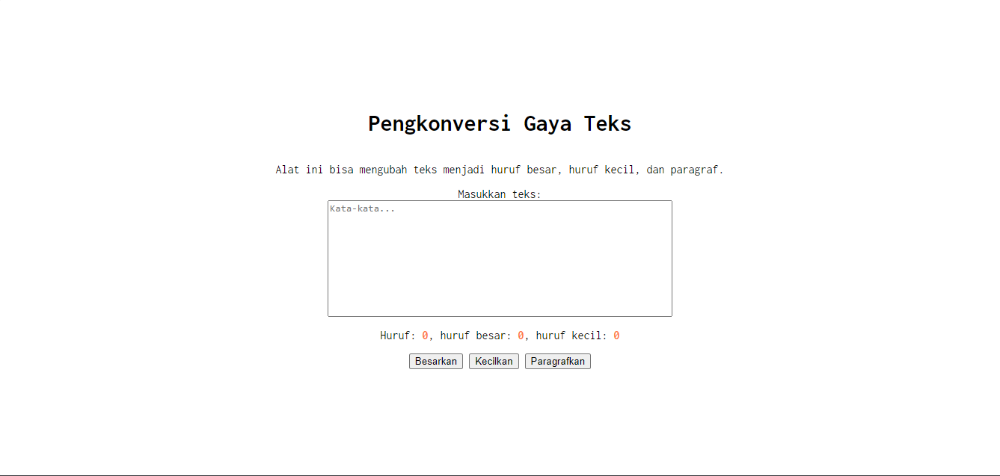

# Tugas Pendahuluan: GUI dengan HTML dan CSS

**Nama:** Felix Erlangga Ananta  
**NIM:** 103122400038  
**Kelas:** SE-08-02

## Tugas
Buatlah tata letak laman yang kamu buat berada di tengah seperti di bawah ini, dan juga ubah font-nya dengan Inconsolata dari Google Fonts.

## Program/Kode

[index.html](./index.html) 
[index.css](./index.css) 
[index.js](./index.js)

## Output


## Deskripsi

Untuk mengubah agar letak laman di tengah dan font di ubah menajdi inconsolata maka style body harus diubah di index.css menjadi
```
body {
    font-family: 'Inconsolata';
    display: flex;
    flex-direction: column;
    align-items: center;
    justify-content: center;
    height: 100vh;
    text-align: center;
}
```
lalu kemudian pada index.html agar mengenali font dari google https://fonts.google.com/specimen/Inconsolata, maka harus menambah kode berikut
```
    <link rel="preconnect" href="https://fonts.googleapis.com">
    <link rel="preconnect" href="https://fonts.gstatic.com" crossorigin>
    <link href="https://fonts.googleapis.com/css2?family=Cabin:ital,wght@0,400..700;1,400..700&family=Fira+Code:wght@300..700&family=Golos+Text:wght@400..900&family=Inconsolata:wght@200..900&family=Nunito+Sans:ital,opsz,wght@0,6..12,200..1000;1,6..12,200..1000&family=Rowdies:wght@300;400;700&display=swap" rel="stylesheet">

```

sehingga tampilannya menjadi seperti ini
