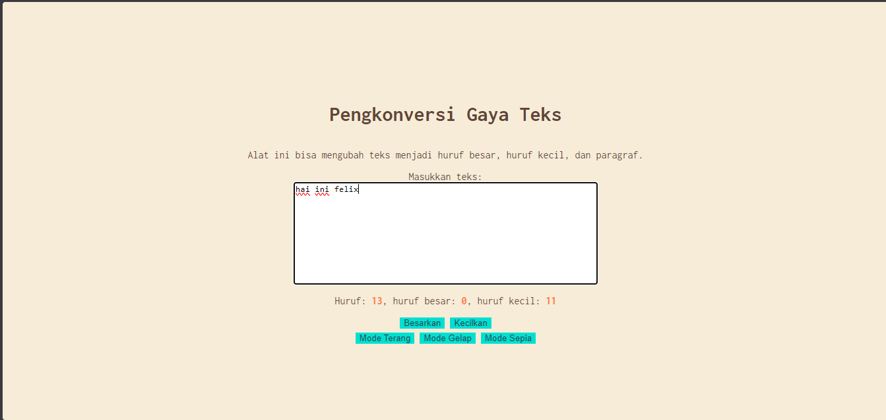

# Tugas Mandiri : Automata dan Table-Driven Construction

**Nama:** Felix Erlangga Ananta  
**NIM:** 103122400038  
**Kelas:** SE-08-02

## Tugas
Tambahkan **mode sepia** dengan ketentuan:

| Elemen           | Warna     |
|------------------|----------|
| Latar belakang   | #F4ECD8  |
| Warna teks       | #5B4636  |

Ketentuan tambahan:
1. Form (textarea) tetap berwarna putih.
2. Bagian mode harus memiliki tiga tombol: **light, dark, dan sepia**.
3. Perpindahan state:
   - `light` → `light-mode`
   - `dark` → `dark-mode`
   - `sepia` → `sepia-mode`

---
## Program/Kode
Tersedia di 
[index.html](./index.html) 
[index.css](./index.css) 
[index.js](./index.js)

## Output


## Deskripsi
Awalnya saya memakai penggunaan nama kelas `mode-gelap / mode-terang` karena ketentuan meminta menggunakan bhs inggris maka saya ubah jadi `dark-mode / light-mode` lalu disini saya menambahkan line css baru yaitu
```
.sepia-mode {
    background-color: #F4ECD8;
    color: #5B4636;
}

```
lalu agar animasi smooth saya menambahkan ini dalam body di css 
```
body {
    ...
    transition: background-color 0.3s ease, color 0.3s ease;
    ...
}
```

kemudian saya tambahkan button baru di html
```
<button id="tombol-sepia">Mode Sepia</button>
```
dan untuk perpindahan statenya saya membuat kode ini di js
```
lightModeButton.addEventListener("click", () => {
    document.body.classList.add("light-mode");
    document.body.classList.remove("dark-mode");
    document.body.classList.remove("sepia-mode");
});

darkModeButton.addEventListener("click", () => {
    document.body.classList.add("dark-mode");
    document.body.classList.remove("light-mode");
    document.body.classList.remove("sepia-mode");
});
sepiaModeButton.addEventListener("click", () => {
    document.body.classList.add("sepia-mode");
    document.body.classList.remove("light-mode");
    document.body.classList.remove("dark-mode");
});
```

terimakasih