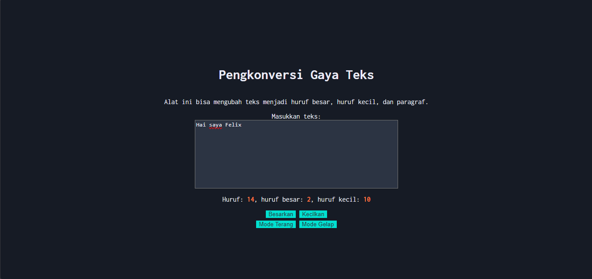

# Tugas Pendahuluan : Automata dan Table-Driven Construction

**Nama:** Felix Erlangga Ananta  
**NIM:** 103122400038  
**Kelas:** SE-08-02

## Tugas
Tambahkan mode gelap sekaligus untuk editor-kecil dan tombol-tombolnya. Ketentuan warna untuk latar belakang editor-kecil adalah `#2e3443`, sementara untuk tombol adalah `#29ddcc`. Teks untuk tombol tetap mengikuti warna teks sebelumnya.

Untuk menghapus pinggiran tombol, nyatakan properti border untuk tidak ditunjukkan.

## Program/Kode
Tersedia di 
[index.html](./index.html) 
[index.css](./index.css) 
[index.js](./index.js)

## Output


## Deskripsi
Disini untuk membuat dark mode, saya menambahkan code baru pada [index.css](./index.css) yaitu

```
.grup-tg {
    margin-top: 5px; /* ini opsional sih biar ada spasinya antara button */ 
}
.mode-gelap {
    background-color: #171b25;
    color: #EBECF7;
}
.mode-gelap .kotak-input {
    background-color: #2e3443;
    color: #EBECF7;
}
.mode-gelap button {
    background-color: #29ddcc;
    color: #2e3443;
}
```
dan untuk menghilangkan border pada tombol
```
button {
    border: none;
}
```

lalu di [index.html](./index.html) saya menambahkan dua tombol sebagai toggle untuk darkmode yaitu
```
    <div class="grup-tg">
      <button id="tombol-terang">Mode Terang</button>
      <button id="tombol-gelap">Mode Gelap</button>
    </div>
```

dan di [index.js](./index.js) saya menambahkan listener button
```
lightModeButton.addEventListener("click", () => {
    document.body.classList.remove("mode-gelap");
});

darkModeButton.addEventListener("click", () => {
    document.body.classList.add("mode-gelap");
});
```

terimakasih