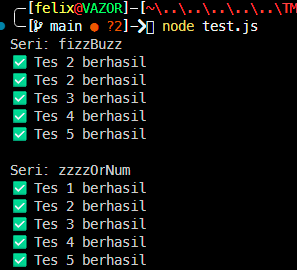

# Tugas Mandiri : Generics

**Nama:** Felix Erlangga Ananta  
**NIM:** 103122400038  
**Kelas:** SE-08-02

## Tugas
Diberikan program index.js seperti ini:
```
// Tambah JSDoc di sini
function zzzzOrNum(value) {
    // Ubah kode di sini
}

// Tambah JSDOC di sini
function fizzBuzz(sequence) {
    // Ubah kode di sini

    const newSequence = sequence.map((e) => zzzzOrNum(e));

    return newSequence;
}

module.exports = {
    fizzBuzz: fizzBuzz,
    zzzzOrNum: zzzzOrNum,
};
```
Aturan FizzBuzz kali ini adalah:

1. Fungsi fizzBuzz hanya menerima larik yang semua elemennya terdiri dari bilangan bulat dan mengeluarkan larik pula yang bisa jadi bercampur string dan bilangan
2. Fungsi zzzzOrNum hanya menerima sebuah data tunggal berupa bilangan bulat dan mengembalikan "Fizz", "FizzBuzz", "Buzz", atau bilanga bulat sesuai logikanya
3. Kedua fungsi harus ada dan harus disertai JSDoc sesuai tipe data yang disiratkan dari no. 1, no. 2, dan perilaku yang diharapkan di bawah
4. fizzBuzz harus menggunakan fungsi zzzzOrNum di dalamnya

## Program/Kode
Tersedia di 
[test.js](./test.js) 
[index.js](./index.js)

## Output


## Deskripsi
Oke jadi saya membuat dua fungsi pada `index.js`, yaitu `zzzzOrNum` dan `fizzBuzz`. Fungsi `zzzzOrNum` digunakan untuk mengecek satu bilangan bulat dan mengembalikan "Fizz" jika habis dibagi 3, "Buzz" jika habis dibagi 5, "FizzBuzz" jika habis dibagi keduanya, atau angka itu sendiri jika tidak memenuhi kondisi tersebut. Fungsi ini juga dilengkapi validasi agar hanya menerima input berupa bilangan bulat.

Kemudian fungsi `fizzBuzz` digunakan untuk memproses sebuah array yang berisi bilangan bulat, dengan cara memetakan setiap elemen menggunakan fungsi `zzzzOrNum`, sehingga menghasilkan array baru yang berisi kombinasi string dan angka sesuai aturan FizzBuzz.

Selanjutnya saya menambahkan `module.exports` agar kedua fungsi tersebut dapat digunakan di file lain, seperti `test.js`. Di dalam `test.js`, fungsi dapat diimpor menggunakan `const { fizzBuzz, zzzzOrNum } = require("./index.js");` untuk dilakukan pengujian.

Terimakasih.
