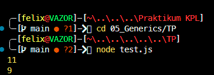

# Tugas Pendahuluan : Generics

**Nama:** Felix Erlangga Ananta  
**NIM:** 103122400038  
**Kelas:** SE-08-02

## Tugas
Ini adalah kode yang mengurus jumlah semua karakter dan jumlah huruf:
```
const str = "Bar bar";

let jumlahSemua = 0;
for (const c of str) { 
    jumlahSemua++; 
}
console.log(total);

let jumlahHuruf = 0;
for (const c of str) { 
    if (c === ' ') continue;
    jumlahHuruf++;
}
console.log(letters);
```
Bagaimana caramu hanya dengan satu fungsi generik bisa mengurus keduanya?

Agar fungsi yang kamu kerjakan benar atau tidak, berikut ini adalah kode tes yang bisa kamu tempelkan:
```
const str = "Bar bar bar";
...
console.log(
   hitung(str, "semua") // Harusnya 11
);

console.log(
  hitung(str, "huruf") // Harusnya 9
);

hitung(str, "huruf"); // Tidak terjadi apa-apa
```
## Program/Kode
Tersedia di 
[test.js](./test.js) 
[index.js](./index.js)

## Output


## Deskripsi
Oke jadi saya membuat fungsi baru yaitu fungsi hitung pada [index.js](./index.js) untuk menghitung jumlah karakter dalam sebuah string berdasarkan mode yang diberikan, yaitu "semua" untuk menghitung seluruh karakter termasuk spasi, dan "huruf" untuk menghitung hanya karakter non-spasi
kemudian saya menambahkan module export agar bisa digunakan dalam [test.js](./test.js), dan disitu tinggal impor menggunakan `const hitung = require("./index.js");`
terimakasih