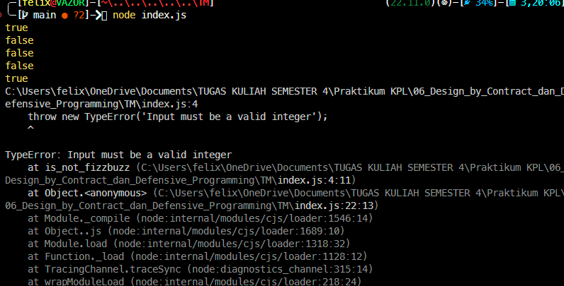

# Tugas Mandiri : Design by Contracts dan Defensive Programming

**Nama:** Felix Erlangga Ananta  
**NIM:** 103122400038  
**Kelas:** SE-08-02

## Tugas
Lindungi kode ini dari bilangan-bilangan "fizz buzz"!

Tugasmu adalah membuat fungsi yang menolak bilangan-bilangan kelipatan 3, 5, atau 15, menerima bilangan-bilangan bukan "fizz buzz", dan melempar yang bukan bilangan bulat.

## Program/Kode
Tersedia di 
[index.js](./index.js)

## Output


## Deskripsi

`is_not_fizzbuzz`

Fungsi `is_not_fizzbuzz` digunakan untuk memvalidasi apakah sebuah angka bukan bagian dari aturan FizzBuzz.

Fungsi ini akan:
- Mengembalikan `true` jika angka bukan kelipatan 3 atau 5
- Mengembalikan `false` jika angka adalah kelipatan 3, 5, atau 15
- Melempar `TypeError` jika input bukan bilangan bulat yang valid

**Aturan Logika**

- Kelipatan 3 → ditolak (`false`)
- Kelipatan 5 → ditolak (`false`)
- Kelipatan 15 → ditolak (`false`)
- Selain itu → diterima (`true`)

**Validasi Input**

Fungsi hanya menerima:
- Bilangan bulat (integer)
- Nilai yang finite (bukan `NaN`, `Infinity`, atau `-Infinity`)

Jika input tidak memenuhi kriteria tersebut, maka fungsi akan melempar error:
```js
TypeError
```