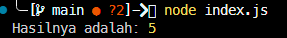

# Tugas Pendahuluan : Design by Contracts dan Defensive Programming

**Nama:** Felix Erlangga Ananta  
**NIM:** 103122400038  
**Kelas:** SE-08-02

## Tugas
Diberikan dua kode yang sama-sama melakukan operasi pembagian. Pertama menggunakan asersi, kedua menggunakan eksepsi. Menurutmu, kapankah kita saatnya menggunakan asersi atau eksepsi untuk fungsi seperti ini di atas? Apakah kita harus sepenuhnya asersi, atau sepenuhnya eksepsi? Lakukan riset dan berikan jawabannya dalam bentuk esai minimal 300 kata.
## Program/Kode
Tersedia di 
[index.js](./index.js)

## Output

## Deskripsi

Dalam fungsi seperti `divide(a, b)`, penggunaan asersi (assertion) dan eksepsi (exception) tidak seharusnya dipilih secara mutlak salah satu, melainkan digunakan secara kontekstual sesuai dengan tujuan masing-masing dalam rekayasa perangkat lunak. Asersi pada dasarnya digunakan untuk memvalidasi asumsi internal program, yaitu kondisi yang seharusnya selalu benar jika tidak terdapat kesalahan dalam logika kode. Oleh karena itu, asersi lebih cocok digunakan pada tahap pengembangan dan debugging untuk mendeteksi bug sedini mungkin. Jika sebuah asersi gagal, hal tersebut mengindikasikan adanya kesalahan dalam desain atau implementasi program, bukan kesalahan dari pengguna. Bahkan, dalam banyak praktik, asersi dapat dinonaktifkan di lingkungan production tanpa memengaruhi jalannya program secara keseluruhan.

Sebaliknya, eksepsi digunakan untuk menangani kondisi error yang memang mungkin terjadi dalam penggunaan nyata, terutama yang berasal dari input pengguna atau faktor eksternal lainnya. Dalam kasus fungsi `divide`, validasi tipe data dan pengecekan pembagian dengan nol merupakan contoh error yang realistis terjadi, sehingga lebih tepat ditangani menggunakan eksepsi. Dengan menggunakan eksepsi, program dapat memberikan respons yang sesuai, seperti menampilkan pesan error atau melakukan fallback, tanpa menyebabkan aplikasi berhenti secara tiba-tiba.

Dengan demikian, pendekatan terbaik adalah mengombinasikan keduanya secara bijak. Eksepsi digunakan sebagai mekanisme utama untuk menangani error yang dapat terjadi dalam runtime, sedangkan asersi digunakan sebagai alat bantu untuk memastikan konsistensi logika internal selama proses pengembangan. Pendekatan ini tidak hanya meningkatkan keandalan program, tetapi juga membantu pengembang dalam menjaga kualitas kode secara keseluruhan.  