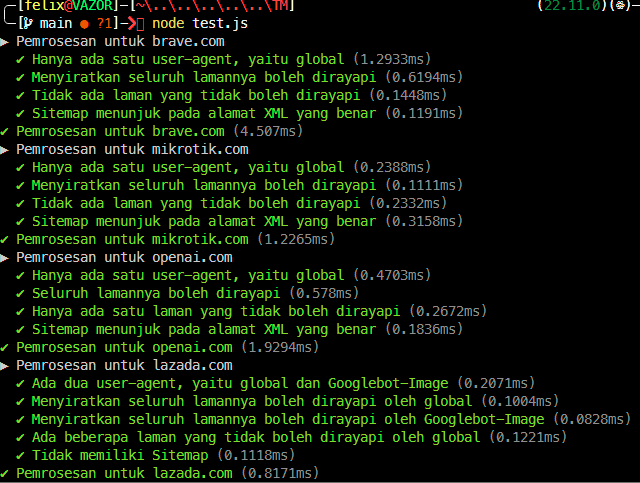
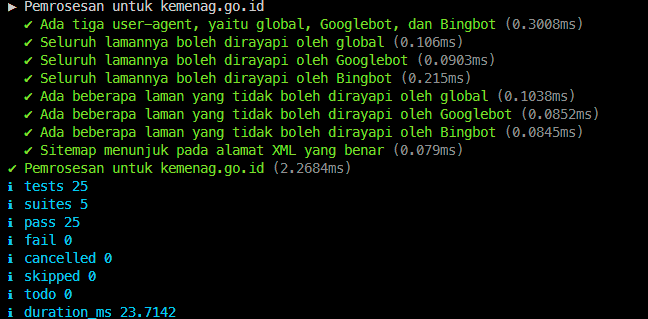

# Tugas Mandiri : Grammar-based Input Processing

**Nama:** Felix Erlangga Ananta  
**NIM:** 103122400038  
**Kelas:** SE-08-02

## Tugas
Uraikan robot!

Tugas pada kesempatan kali ini adalah membuat fungsi yang menguraikan isi robots.txt menjadi POJO (plain old JavaScript object). Empat properti yang perlu diuraikan dijabarkan di bawah berikut.

User-agent adalah nama robot perayapnya
Allow adalah daftar halaman-halaman yang boleh dirayap
Disallow adalah daftar halaman-halaman yang tidak boleh dirayap
Sitemap adalah sebuah pranala yang menunjuk pada "denah" situs web (biasanya berformat XML)
Kamu akan mengerjakannya di dalam sebuah fungsi bernama parseRobots di index.js dan. Buka direktori 07 di sini untuk mengunduh berkas yang dimaksud, berkas-berikas robots.txt di dalam direktori daftar, dan berkas pengujiannya yaitu test.js.

Jadi, strukturnya harus seperti ini:
```
|   index.js
|   structure.d.ts // Opsional mau ada atau tidak
|   test.js
\---daftar
        brave.txt
        kemenag.txt
        lazada.txt
        mikrotik.txt
        nikkei.txt
        openai.txt
```
Agar kode yang kamu tulis di index.js bekerja atau tidak, jalankan test.js. Jika kamu membuat proyek Node (yang ada package.json), pastikan untuk membuat impor menjadi CommonJS dengan type: commonjs.

Beberapa petunjuk:

1. Manajemen state akan membantu
2. Nilai tambah jika kamu bisa mendeskripsikannya secara code tracing
3. Tidak perlu program untuk membaca TXT, itu sudah dilakukan oleh test.js
4. Hubungi asprak jika ada kendala atau kesalahan

## Program/Kode
Tersedia di 
[index.js](./index.js)
[test.js](./test.js)

## Output



## Deskripsi

Fungsi parseRobots digunakan untuk mengubah isi berkas robots.txt
menjadi sebuah objek JavaScript sederhana (Plain Old JavaScript Object /
POJO). Objek ini merepresentasikan aturan perayapan (crawling rules)
yang ditentukan oleh sebuah situs web.

Format robots.txt bersifat semi-terstruktur, sehingga diperlukan proses
parsing berbasis baris dengan pendekatan manajemen state.

Cara Kerja

1.  Memecah teks menjadi baris
2.  Mengabaikan baris kosong dan komentar
3.  Parsing key-value dengan indexOf(‘:’)
4.  Menggunakan state currentAgents
5.  Memproses directive (User-agent, Allow, Disallow, Sitemap, Host)

Kesimpulan

Parser bekerja dengan membaca baris, menjaga state, dan mengelompokkan
aturan berdasarkan agent.
