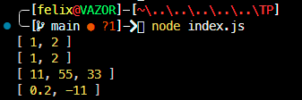

# Tugas Pendahuluan : Grammar-based Input Processing

**Nama:** Felix Erlangga Ananta  
**NIM:** 103122400038  
**Kelas:** SE-08-02

## Tugas
Buatlah fungsi yang mengubah deretan angka bertipe string menjadi larik angka.
## Program/Kode
Tersedia di 
[index.js](./index.js)

## Output


## Deskripsi

## Deskripsi

Fungsi `toNumberArray` digunakan untuk mengubah input berupa deretan angka dalam bentuk string atau array string menjadi sebuah array yang berisi angka (number). Fungsi ini dirancang agar fleksibel dalam menangani berbagai bentuk input, seperti string dengan pemisah koma maupun array yang berisi elemen string.

**Tujuan**

- Mengonversi data numerik dari tipe string ke tipe number
- Menangani input yang tidak konsisten (string atau array)
- Mengabaikan nilai yang tidak dapat dikonversi menjadi angka valid

**Cara Kerja**

1. **Normalisasi Input**
   - Jika input berupa string, maka string akan dipisahkan menjadi array menggunakan tanda koma sebagai delimiter.
   - Jika input sudah berupa array, maka langsung digunakan tanpa perubahan.
   - Jika input bukan keduanya, fungsi akan mengembalikan array kosong.

2. **Pembersihan Data**
   - Setiap elemen akan diubah menjadi string (untuk keamanan tipe data).
   - Spasi di awal dan akhir elemen akan dihapus menggunakan `trim()`.

3. **Konversi ke Number**
   - Setiap elemen yang sudah dibersihkan akan dikonversi menjadi number menggunakan `Number()`.

4. **Validasi**
   - Hanya nilai yang berhasil dikonversi menjadi angka valid yang akan dipertahankan.
   - Nilai yang menghasilkan `NaN` akan dihapus dari hasil akhir.

**Contoh Penggunaan**

```javascript
toNumberArray("1, 2") 
// Output: [1, 2]

toNumberArray(["1", "2"]) 
// Output: [1, 2]

toNumberArray(" 11,55,33   ") 
// Output: [11, 55, 33]

toNumberArray(["0.2", "-11", "abc23"]) 
// Output: [0.2, -11]
```