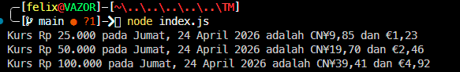

# Tugas Mandiri : Runtime Configuration dan Internationalization

**Nama:** Felix Erlangga Ananta  
**NIM:** 103122400038  
**Kelas:** SE-08-02

## Tugas

Waktunya menukar uang!

Pada tugas ini kamu akan membuat program yang menampilkan kurs rupiah (IDR) terhadap renminbi luar Tiongkok (CNH) dan euro (EUR). Gunakan [link API ini](https://cdn.jsdelivr.net/npm/@fawazahmed0/currency-api@latest/v1/currencies/idr.json) untuk mengambil data.

Tantangan

1. Simpanlah URL API ke dalam `.env` sebagai `BASE_API`
2. Gunakan `Intl` untuk memformat nilai mata uang dan waktu kamu mengambil data kurs.
3. Hapus pesan promosi `dotenv`

   

Lalu pastikan outputnya tampak seperti di bawah ini.

Ujilah dengan Rp25000, Rp50000, dan Rp100000.

## Program/Kode
Tersedia di 
[index.js](./index.js)

## Output

# Deskripsi

Program ini digunakan untuk menampilkan konversi nilai rupiah (IDR) ke mata uang renminbi (CNH) dan euro (EUR) dengan mengambil data kurs secara real-time dari API yang disimpan dalam file `.env`. Data kurs diambil menggunakan `fetch`, kemudian nilai rupiah yang diberikan dikonversi dengan cara mengalikan jumlah uang dengan nilai tukar yang tersedia pada API. Hasil konversi tersebut diformat menggunakan `Intl.NumberFormat` agar tampil sebagai mata uang sesuai standar lokal, sedangkan tanggal pengambilan data diformat menggunakan `Intl.DateTimeFormat` agar mengikuti format penulisan tanggal dalam bahasa Indonesia. Program ini memastikan output yang dihasilkan rapi, mudah dibaca, dan sesuai dengan format yang telah ditentukan dalam soal.