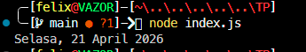

# Tugas Pendahuluan : Runtime Configuration dan Internationalization

**Nama:** Felix Erlangga Ananta  
**NIM:** 103122400038  
**Kelas:** SE-08-02

## Tugas

Tampilkan tanggal sekarang dengan format seperti ini:

```
Sabtu, 18 April 2026
```
Nilai waktu tidak harus sama, asalkan formatnya benar dan bisa tampil di komputer terpisah pada waktu tertentu. Gunakan Intl.DateTimeFormat (bukan string manual).

## Program/Kode
Tersedia di 
[index.js](./index.js)

## Output


## Deskripsi
Fungsi ini digunakan untuk menampilkan tanggal saat ini dengan format lengkap dalam bahasa Indonesia menggunakan `Intl.DateTimeFormat`, sehingga tidak perlu menyusun string tanggal secara manual. Objek `Date` digunakan untuk mengambil waktu dari sistem, lalu formatter dikonfigurasi dengan locale `id-ID` agar nama hari dan bulan tampil dalam bahasa Indonesia, serta opsi `weekday`, `day`, `month`, dan `year` untuk menentukan struktur output. Hasil akhirnya berupa string seperti "Sabtu, 18 April 2026" yang akan menyesuaikan secara otomatis dengan waktu pada perangkat atau lingkungan tempat kode dijalankan.