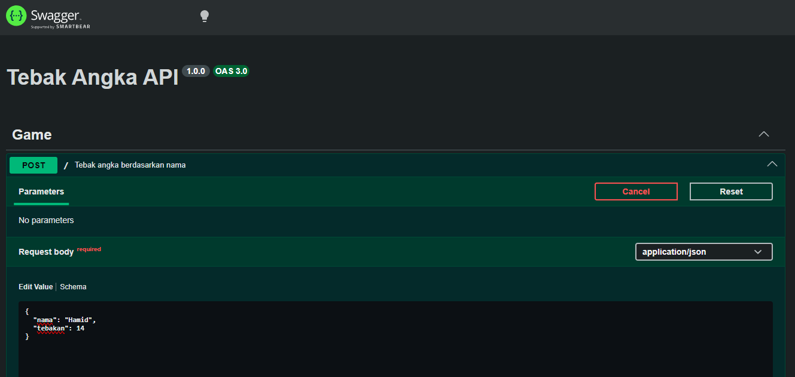
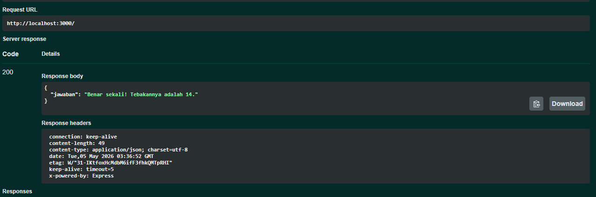
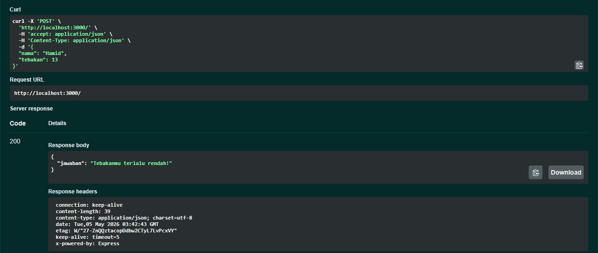
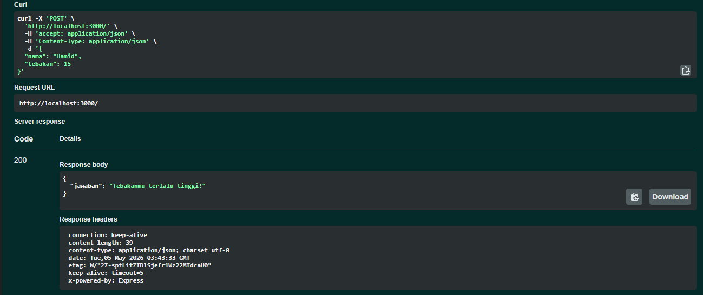

# Tugas Mandiri : API Design dan Construction Using Swagger

**Nama:** Felix Erlangga Ananta  
**NIM:** 103122400038  
**Kelas:** SE-08-02

## Tugas

Mari kita main tebak-tebakan angka acak!

Tugasmu adalah membuat API yang terdiri dari satu endpoint saja, yaitu POST /. Ketika kita melakkukan POST, formatnya adalah seperti di bawah ini.
```
{
  "nama": "Hamid",
  "tebakan": 24
}
```
Jika tebakan benar.
```
{
    "jawaban": "Benar sekali! Tebakannya adalah 24."
}
```
Jika tebakan terlalu tinggi.
```
{
    "jawaban": "Tebakanmu terlalu tinggi!"
}
```
Jika tebakan terlalu rendah.
```
{
    "jawaban": "Tebakanmu terlalu rendah!"
}
```
Beberapa aturan:

1. Angka acak yang dihasilkan harus tetap dan tidak boleh berubah setiap kali permintaan API dilakukan, tetapi boleh berubah setiap harinya atau dibuat tetap selamanya
2. Rentang harus di antara 1-100
3. Nama harus sensitif terhadap besar kecil huruf (mis. hamid dan Hamid akan menghasilkan angka acak yang berbeda)
4. Tidak menggunakan pustaka apapun, murni mengandalkan nama dan tebakan

Penjelasan untuk nomor 1: Jika namanya Hamid, ia akan diharapkan tetap pada nilai tebakan 24 mau kamu melakukan 100 kali permintaan. Tidak ada jawaban benar di sini (Hamid tidak harus 24, bebas mau dibuat acak seperti apa yang penting harus tetap).

## Program/Kode
Tersedia di 
[index.js](./index.js)

## Output
Tebakan benar


Tebakan terlalu rendah

Tebakan terlalu tinggi



## Deskripsi

API ini adalah game tebak angka sederhana dengan satu endpoint `POST /`. Inputnya berupa nama dan angka tebakan dalam format JSON, lalu sistem menghasilkan angka rahasia dari nama tersebut di range 1–100. Angkanya selalu konsisten untuk nama yang sama, tapi beda huruf besar-kecil bakal beda hasil. Outputnya cuma ngasih tahu apakah tebakan benar, terlalu tinggi, atau terlalu rendah.

Dokumentasi disediain lewat Swagger di `/docs`, jadi endpoint bisa langsung dicoba dari browser tanpa perlu tool tambahan. Swagger dibuat pakai `swagger-jsdoc` dan `swagger-ui-express`, yang ambil definisi API dari komentar di kode lalu ditampilin jadi UI interaktif.