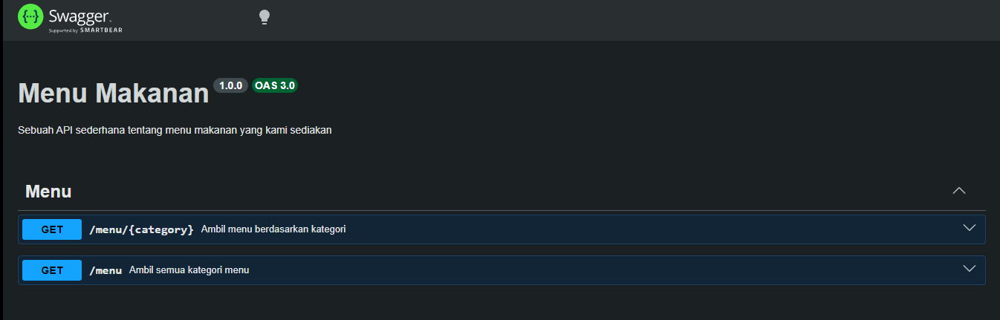

# Tugas Pendahuluan : API Design dan Construction Using Swagger

**Nama:** Felix Erlangga Ananta  
**NIM:** 103122400038  
**Kelas:** SE-08-02

## Tugas

Buatlah satu endpoint lagi beserta dokumentasi OpenAPI-nya, yaitu GET /menu yang menampilkan daftar semua nama kategori menu yang ada.

## Program/Kode
Tersedia di 
[index.js](./index.js)
[swagger.js](./swagger.js)

## Output

## Deskripsi
Endpoint **GET /menu** digunakan untuk mengambil daftar seluruh kategori menu yang tersedia pada sistem dengan cara membaca key dari objek data menu, sehingga menghasilkan array berisi nama-nama kategori seperti *bakmi* dan *rames*. Endpoint ini tidak memerlukan parameter apa pun dan akan mengembalikan respons sukses berupa objek JSON dengan properti `kategori_tersedia` jika data ditemukan, atau respons error jika tidak ada kategori yang tersedia. Dokumentasi OpenAPI ditambahkan menggunakan anotasi JSDoc agar dapat secara otomatis terbaca oleh `swagger-jsdoc` dan ditampilkan melalui Swagger UI pada endpoint `/docs`, sehingga memudahkan pengujian dan pemahaman struktur API.