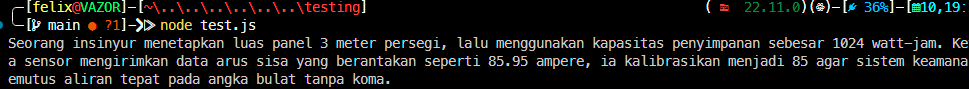

# Tugas Mandiri : Library Construction

**Nama:** Felix Erlangga Ananta  
**NIM:** 103122400038  
**Kelas:** SE-08-02

## Tugas

Buatkan pustaka yang rapi!

Pada tugas ini buatlah sebuah proyek baru bernama mtk-gampang. Struktur proyeknya wajib diatur seperti di bawah ini.
```
|   index.js
|   package.json
\---lib
        pangkat.js
        bulat.js
        kuadrat.js
```
Setiap berkas lib hanya memiliki satu fungsi saja.

pangkat.js berisi fungsi pangkat(x, y) yang mengembalikan nilai akhir dari x pangkat y.
bulat.js berisi fungsi bulat(x) yang mengubah bentuk bilangan non-bulat menjadi bulat (mis. -4.25 menjadi -4) .
kuadrat.js berisi fungsi kuadrat(x) yang mengembalikan nilai akar kuadrat 2 dari x.
Satu batasannya adalah fungsi-fungsi ini harus diakses dari index.js (sebagai nilai dari properti main), bukan dari lib masing-masing.

Jika sudah selesai, buatlah proyek baru lagi dan instal pustaka yang kamu buat secara lokal. Pada index.js-nya, gunakan kode ini untuk memastikan bahwa kamu berhasil melakukannya.

```
import { kuadrat, pangkat, bulat } from "libr";

const narasi = `Seorang insinyur menetapkan luas panel ${bulat(kuadrat(12))} meter persegi, lalu menggunakan kapasitas penyimpanan sebesar ${pangkat(2, 10)} watt-jam. Ketika sensor mengirimkan data arus sisa yang berantakan seperti 85.95 ampere, ia kalibrasikan menjadi ${bulat(85.95)} agar sistem keamanan memutus aliran tepat pada angka bulat tanpa koma.`;

/**
 * Seorang insinyur menetapkan luas panel 3 meter persegi, lalu menggunakan kapasitas penyimpanan sebesar 1024 watt-jam. Ketika sensor mengirimkan data arus sisa yang berantakan seperti 85.95 ampere, ia kalibrasikan menjadi 85 agar sistem keamanan memutus aliran tepat pada angka bulat tanpa koma.
 * /

console.log(narasi);
```
## Program/Kode
Tersedia di 
[index.js](mtk-gampang/index.js)
[test.js](testing/test.js)

## Output


## Deskripsi

Pada tugas ini, fokus utamanya adalah membangun sebuah pustaka (library) matematika sederhana bernama **mtk-gampang** menggunakan JavaScript modern dengan standar **ECMAScript Modules (ESM)**. Library ini dirancang untuk menyediakan beberapa fungsi matematika dasar yang dapat digunakan kembali pada proyek lain melalui proses instalasi lokal.

**Implementasi Library Construction**

Dalam pengembangan pustaka ini, diterapkan prinsip **modularitas** dengan memisahkan setiap fungsi ke dalam berkas yang berbeda pada folder `lib`. Setiap berkas hanya memiliki satu tanggung jawab sehingga kode menjadi lebih terstruktur, mudah dipelihara, dan mudah dikembangkan.

* **pangkat.js** berisi fungsi `pangkat(x, y)` yang digunakan untuk menghitung nilai `x` pangkat `y`.
* **bulat.js** berisi fungsi `bulat(x)` yang mengubah bilangan desimal menjadi bilangan bulat dengan menghilangkan bagian pecahannya, misalnya `85.95` menjadi `85` atau `-4.25` menjadi `-4`.
* **kuadrat.js** berisi fungsi `kuadrat(x)` yang digunakan untuk menghitung akar kuadrat dari suatu bilangan.

**Pola Ekspor dan Impor (ES Modules)**

Sesuai ketentuan tugas, seluruh fungsi tidak diakses langsung dari folder `lib`, melainkan melalui berkas **index.js** sebagai titik masuk utama (entry point) library. Berkas `index.js` mengimpor seluruh fungsi dari folder `lib` kemudian mengekspornya kembali agar pengguna cukup melakukan satu kali impor saat menggunakan library.

Contoh penggunaan:

```javascript
import { kuadrat, pangkat, bulat } from "libr";
```

Pendekatan ini membuat struktur internal library tetap tersembunyi dan memudahkan proses pemeliharaan apabila terjadi perubahan pada implementasi di masa mendatang.

**Analisis Struktur Pustaka**

Struktur proyek dipisahkan menjadi beberapa bagian utama, yaitu:

* **package.json** sebagai konfigurasi proyek dan identitas library.
* **index.js** sebagai entry point yang mengelola ekspor seluruh fungsi.
* **folder lib/** sebagai tempat penyimpanan implementasi fungsi-fungsi matematika.

Konfigurasi `"type": "module"` pada `package.json` digunakan agar Node.js menjalankan proyek menggunakan standar **ES Modules**, sehingga sintaks `import` dan `export` dapat digunakan secara langsung. Dengan struktur ini, library menjadi lebih terorganisir, mudah digunakan kembali, serta mengikuti praktik pengembangan perangkat lunak modern yang menekankan modularitas dan reusabilitas kode.
