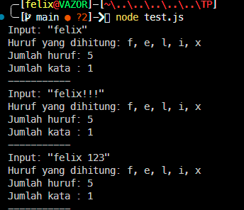

# Tugas Pendahuluan : Library Construction

**Nama:** Felix Erlangga Ananta  
**NIM:** 103122400038  
**Kelas:** SE-08-02

## Tugas

Buatlah pustaka JavaScript yang menyediakan utilitas berupa dua fungsi yang menghitung jumlah huruf dan jumlah kata.

Kriteria:

1. Hanya alfabet A hingga Z yang dihitung (besar dan kecil)
2. Spasi tidak dihitung
3. Pustaka bisa diimpor

## Program/Kode
Tersedia di 
[index.js](./index.js)
[test.js](./test.js)

## Output

## Deskripsi
# Deskripsi

Pustaka ini menyediakan dua utilitas sederhana untuk mengolah teks, yaitu menghitung jumlah huruf dan jumlah kata dalam sebuah string. Perhitungan huruf hanya mencakup alfabet A hingga Z (baik huruf besar maupun kecil), sehingga karakter seperti angka, simbol, dan spasi tidak ikut dihitung. Dengan pendekatan ini, hasil yang diberikan tetap konsisten dan fokus pada konten alfabet saja.

Selain itu, jumlah kata dihitung berdasarkan kumpulan huruf yang membentuk satu kesatuan, sehingga setiap rangkaian alfabet dianggap sebagai satu kata. 
