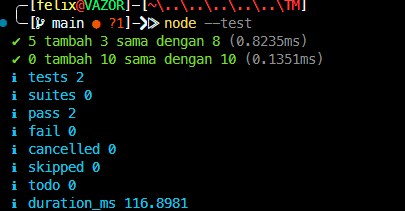

# Tugas Mandiri : Performance Analysis, Unit Testing, dan Debugging

**Nama:** Felix Erlangga Ananta  
**NIM:** 103122400038  
**Kelas:** SE-08-02

## Tugas
Tambah dan tambah!

Fungsi di bawah ini melakukan penjumlaha pada penghitung (counter), yang sesederhana menambahk jumlah jika kamu menekan tombol.

hitung.js
```javascript
function tambahPengitung(terkini, jumlah) {
  terkini = terkini + jumlah;
  return terkini;
}
```
hitung.test.js
```javascript
import { test } from 'node:test';
import assert from 'node:assert';
import { tambahPengitung } from './hitung.js';

test('5 tambah 3 sama dengan 8', () => {
  assert.strictEqual(tambahPengitung(5, 3), 8);
});

test('0 tambah 10 sama dengan 10', () => {
  assert.strictEqual(tambahPengitung(0, 10), 10);
});
```
Bisakah kamu tunjukkan apakah kode sudah benar atau bagian mana yang perlu diperbaiki beserta alasannya?

## Program/Kode
Tersedia di [hitung.js](./hitung.js)
Tersedia di [hitung.test.js](./hitung.test.js)

## Output


## Deskripsi
Program ini digunakan untuk melakukan penjumlahan pada sebuah penghitung (counter). Fungsi menerima dua parameter, yaitu nilai penghitung saat ini (`terkini`) dan nilai yang akan ditambahkan (`jumlah`). Hasil penjumlahan kemudian dikembalikan sebagai nilai penghitung yang baru.

Untuk memastikan fungsi bekerja dengan benar, dibuat beberapa unit test menggunakan Node.js Test Runner dan modul Assert. Unit test digunakan untuk memverifikasi bahwa fungsi menghasilkan output yang sesuai dengan nilai yang diharapkan.

---

**Kode Sebelum Diperbaiki**

**hitung.js**

```javascript
function tambahPengitung(terkini, jumlah) {
  terkini = terkini + jumlah;
  return terkini;
}
```

**hitung.test.js**

```javascript
import { test } from 'node:test';
import assert from 'node:assert';
import { tambahPengitung } from './hitung.js';

test('5 tambah 3 sama dengan 8', () => {
  assert.strictEqual(tambahPengitung(5, 3), 8);
});

test('0 tambah 10 sama dengan 10', () => {
  assert.strictEqual(tambahPengitung(0, 10), 10);
});
```

---

**Analisis Kecacatan**

Secara logika, fungsi penjumlahan sudah menghasilkan hasil yang benar. Namun terdapat masalah pada struktur modul yang digunakan.

Pada file pengujian terdapat kode:

```javascript
import { tambahPengitung } from './hitung.js';
```

Agar sebuah fungsi dapat diimpor dari file lain, fungsi tersebut harus diekspor terlebih dahulu menggunakan keyword `export`.

Pada kode awal, fungsi ditulis sebagai:

```javascript
function tambahPengitung(terkini, jumlah) {
  terkini = terkini + jumlah;
  return terkini;
}
```

Karena tidak terdapat `export`, maka saat pengujian dijalankan akan muncul error bahwa modul tidak menyediakan export bernama `tambahPengitung`.

Contoh error:

```text
The requested module './hitung.js' does not provide an export named 'tambahPengitung'
```

Dengan demikian, kecacatan utama pada program bukan terletak pada logika penjumlahannya, melainkan pada mekanisme ekspor modul.

---

**Kode Setelah Diperbaiki**

**hitung.js**

```javascript
export function tambahPengitung(terkini, jumlah) {
  return terkini + jumlah;
}
```

**hitung.test.js**

```javascript
import { test } from 'node:test';
import assert from 'node:assert';
import { tambahPengitung } from './hitung.js';

test('5 tambah 3 sama dengan 8', () => {
  assert.strictEqual(tambahPengitung(5, 3), 8);
});

test('0 tambah 10 sama dengan 10', () => {
  assert.strictEqual(tambahPengitung(0, 10), 10);
});
```

**package.json**

```json
{
  "name": "tambah-pengitung",
  "version": "1.0.0",
  "type": "module",
  "scripts": {
    "test": "node --test"
  }
}
```

---

**Penjelasan Fungsi `tambahPengitung()`**

Fungsi ini bertugas menjumlahkan nilai penghitung saat ini dengan nilai yang diberikan.

```javascript
export function tambahPengitung(terkini, jumlah) {
  return terkini + jumlah;
}
```

Parameter yang digunakan:

* `terkini` : nilai penghitung saat ini.
* `jumlah` : nilai yang akan ditambahkan.

Proses yang dilakukan:

1. Menerima nilai penghitung saat ini.
2. Menerima nilai tambahan.
3. Menjumlahkan kedua nilai tersebut.
4. Mengembalikan hasil penjumlahan.

Contoh:

```javascript
tambahPengitung(5, 3);
```

Perhitungan:

```text
5 + 3 = 8
```

Hasil:

```text
8
```

---

**Penjelasan Unit Test**

**Test 1**

```javascript
test('5 tambah 3 sama dengan 8', () => {
  assert.strictEqual(tambahPengitung(5, 3), 8);
});
```

Tujuan:

Memastikan bahwa fungsi dapat menjumlahkan angka positif dengan benar.

Input:

```text
5 dan 3
```

Output yang diharapkan:

```text
8
```

---

**Test 2**

```javascript
test('0 tambah 10 sama dengan 10', () => {
  assert.strictEqual(tambahPengitung(0, 10), 10);
});
```

Tujuan:

Memastikan fungsi tetap bekerja ketika nilai awal penghitung adalah nol.

Input:

```text
0 dan 10
```

Output yang diharapkan:

```text
10
```

---

**Hasil Pengujian**

Jika program dijalankan menggunakan perintah:

```bash
npm test
```

Maka seluruh pengujian akan berhasil.

Contoh hasil:

```text
✔ 5 tambah 3 sama dengan 8
✔ 0 tambah 10 sama dengan 10

tests 2
pass 2
fail 0
```

---

**Kesimpulan**

Berdasarkan hasil analisis, logika penjumlahan pada fungsi `tambahPengitung()` sudah benar dan tidak memerlukan perubahan. Kecacatan yang ditemukan adalah fungsi belum diekspor sehingga tidak dapat digunakan oleh file pengujian. Perbaikan dilakukan dengan menambahkan keyword `export` pada fungsi. Setelah perbaikan dilakukan, seluruh unit test dapat dijalankan dengan sukses dan menghasilkan keluaran sesuai yang diharapkan.
