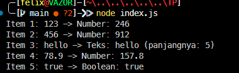

# Tugas Pendahuluan : Performance Analysis, Unit Testing, dan Debugging

**Nama:** Felix Erlangga Ananta  
**NIM:** 103122400038  
**Kelas:** SE-08-02

## Tugas
Cobalah untuk menangkap kecacatan dalam kode ini
```javascript
function main() {
  const data = [
    "123",
    456,
    "hello",
    78.9,
    true,
  ];

  for (let i = 0; i < data.length; i++) {
    const result = processData(data[i]);
    console.log(`Item ${i + 1}: ${data[i]} -> ${result}`);
  }
}

function processData(data) {
  const str = data.toLowerCase();
  const num = parseInt(str);
  if (!isNaN(num) && str === String(num)) {
    return `Number: ${num * 2}`;
  }
  return `Teks: ${str} (panjangnya: ${str.length})`;
}

main();
```

## Program/Kode
Tersedia di [index.js](./index.js)
## Output

## Deskripsi

Program ini bertujuan untuk memproses berbagai jenis data yang tersimpan dalam sebuah array. Setiap data akan diperiksa apakah merupakan angka atau teks, kemudian ditampilkan hasil pengolahannya. Jika data berupa angka, program akan mengalikan nilainya dengan dua. Jika data berupa teks, program akan mengubah teks menjadi huruf kecil dan menampilkan panjang karakter teks tersebut.

Pada versi awal, program memiliki beberapa kecacatan yang menyebabkan terjadinya error saat memproses data bertipe selain string. Oleh karena itu, dilakukan perbaikan agar program dapat menangani berbagai tipe data seperti string, number, dan boolean dengan aman.

---

**Kode Sebelum Diperbaiki**

```javascript
function main() {
  const data = [
    "123",
    456,
    "hello",
    78.9,
    true,
  ];

  for (let i = 0; i < data.length; i++) {
    const result = processData(data[i]);
    console.log(`Item ${i + 1}: ${data[i]} -> ${result}`);
  }
}

function processData(data) {
  const str = data.toLowerCase();
  const num = parseInt(str);
  if (!isNaN(num) && str === String(num)) {
    return `Number: ${num * 2}`;
  }
  return `Teks: ${str} (panjangnya: ${str.length})`;
}

main();
```

---

**Kecacatan yang Ditemukan**

1. Fungsi `toLowerCase()` hanya dapat digunakan pada tipe data string. Ketika program memproses data berupa angka (`456`, `78.9`) atau boolean (`true`), program akan menghasilkan error.
2. Penggunaan `parseInt()` tidak dapat menangani angka desimal dengan baik sehingga nilai seperti `78.9` tidak dikenali sebagai angka yang valid.
3. Tidak terdapat validasi tipe data sebelum data diproses.
4. Program berhenti saat menemukan error sehingga data berikutnya tidak dapat diproses.

---

**Kode Setelah Diperbaiki**

```javascript
function main() {
  const data = [
    "123",
    456,
    "hello",
    78.9,
    true,
  ];

  for (let i = 0; i < data.length; i++) {
    const result = processData(data[i]);
    console.log(`Item ${i + 1}: ${data[i]} -> ${result}`);
  }
}

function processData(data) {
  if (typeof data === "number") {
    return `Number: ${data * 2}`;
  }

  if (typeof data === "boolean") {
    return `Boolean: ${data}`;
  }

  if (typeof data === "string") {
    const str = data.toLowerCase();
    const num = Number(str);

    if (!isNaN(num)) {
      return `Number: ${num * 2}`;
    }

    return `Teks: ${str} (panjangnya: ${str.length})`;
  }

  return "Tipe data tidak didukung";
}

main();
```

---

**Penjelasan Fungsi `main()`**

Fungsi `main()` merupakan fungsi utama yang menjalankan program.

Langkah-langkah yang dilakukan:

1. Membuat array `data` yang berisi beberapa jenis data, yaitu string, number, dan boolean.
2. Melakukan perulangan menggunakan `for` untuk mengakses setiap elemen dalam array.
3. Mengirimkan setiap elemen ke fungsi `processData()` untuk diproses.
4. Menampilkan hasil pemrosesan ke console menggunakan `console.log()`.

Potongan kode utama:

```javascript
for (let i = 0; i < data.length; i++) {
  const result = processData(data[i]);
  console.log(`Item ${i + 1}: ${data[i]} -> ${result}`);
}
```

---

**Penjelasan Fungsi `processData()`**

Fungsi `processData()` bertugas memproses data berdasarkan tipe datanya.

**1. Memeriksa apakah data berupa angka**

```javascript
if (typeof data === "number") {
  return `Number: ${data * 2}`;
}
```

Jika data bertipe `number`, maka nilainya dikalikan dua dan hasilnya dikembalikan.

Contoh:

```javascript
456
```

menjadi:

```javascript
Number: 912
```

---

**2. Memeriksa apakah data berupa boolean**

```javascript
if (typeof data === "boolean") {
  return `Boolean: ${data}`;
}
```

Jika data bertipe boolean, program akan menampilkan nilai boolean tersebut.

Contoh:

```javascript
true
```

menjadi:

```javascript
Boolean: true
```

---

**3. Memeriksa apakah data berupa string**

```javascript
if (typeof data === "string") {
```

Jika data berupa string, program akan:

* Mengubah seluruh huruf menjadi huruf kecil menggunakan `toLowerCase()`.
* Memeriksa apakah string tersebut sebenarnya merupakan angka.
* Jika angka, nilai akan dikalikan dua.
* Jika bukan angka, program akan menampilkan teks beserta jumlah karakternya.

Contoh:

```javascript
"123"
```

menjadi:

```javascript
Number: 246
```

Sedangkan:

```javascript
"hello"
```

menjadi:

```javascript
Teks: hello (panjangnya: 5)
```

---

**4. Menangani tipe data yang tidak didukung**

```javascript
return "Tipe data tidak didukung";
```

Bagian ini berfungsi sebagai pengaman apabila terdapat tipe data selain string, number, atau boolean.

---

**Kesimpulan**

Berdasarkan hasil analisis, program awal memiliki kecacatan karena mengasumsikan seluruh data bertipe string dan langsung memanggil fungsi `toLowerCase()`. Perbaikan dilakukan dengan menambahkan validasi tipe data menggunakan operator `typeof` serta mengganti `parseInt()` menjadi `Number()` agar dapat menangani angka desimal dengan lebih baik. Setelah diperbaiki, program mampu memproses data bertipe string, number, dan boolean tanpa menghasilkan error.
