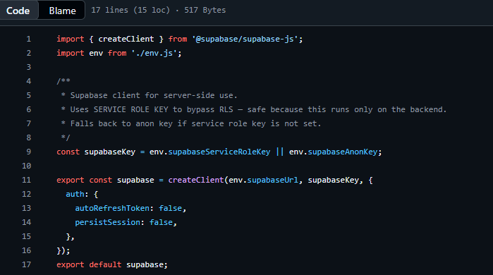

# Tugas Pendahuluan : Design Pattern Implementation

**Nama:** Felix Erlangga Ananta  
**NIM:** 103122400038  
**Kelas:** SE-08-02

## Tugas
Bukalah repostori kode tugas besarmu dan carilah satu saja design pattern yang digunakan di dalamnya (boleh design pattern apa saja, akan direviu kasus-per-kasus). Sertakan kodenya di tugas ini dan coba jelaskan desainnya.

## Program/Kode
Tersedia di [supabase.js](https://github.com/SQL-Builders/Telkom-In-Competition/blob/main/backend/src/config/supabase.js)
## Output

## Deskripsi

File [supabase.js](https://github.com/SQL-Builders/Telkom-In-Competition/blob/main/backend/src/config/supabase.js) berfungsi sebagai konfigurasi dan inisialisasi koneksi ke layanan Supabase yang digunakan oleh seluruh bagian backend aplikasi. File ini membuat satu instance Supabase Client yang dapat digunakan kembali oleh controller, service, maupun repository tanpa perlu membuat koneksi baru setiap kali dibutuhkan.

Dengan pendekatan ini, konfigurasi koneksi menjadi terpusat, lebih mudah dikelola, dan mengurangi duplikasi kode pada aplikasi.

---

**Kode**

```javascript
import { createClient } from '@supabase/supabase-js';
import env from './env.js';

/**
 * Supabase client for server-side use.
 * Uses SERVICE ROLE KEY to bypass RLS — safe because this runs only on the backend.
 * Falls back to anon key if service role key is not set.
 */
const supabaseKey = env.supabaseServiceRoleKey || env.supabaseAnonKey;

export const supabase = createClient(env.supabaseUrl, supabaseKey, {
  auth: {
    autoRefreshToken: false,
    persistSession: false,
  },
});

export default supabase;
```

---

**Design Pattern yang Digunakan**

File ini menerapkan pola desain **Singleton Pattern**.

Singleton Pattern adalah pola desain yang memastikan hanya terdapat satu instance objek yang digunakan selama aplikasi berjalan. Tujuannya adalah menyediakan satu titik akses global terhadap objek tersebut sehingga seluruh bagian aplikasi menggunakan instance yang sama.

Pada JavaScript ES Module, setiap module hanya dieksekusi satu kali saat pertama kali diimpor. Setelah itu, hasil ekspor dari module akan disimpan dalam cache dan digunakan kembali oleh seluruh file yang melakukan import.

Karena itu, kode:

```javascript
export const supabase = createClient(...)
```

hanya akan dijalankan satu kali selama aplikasi berjalan.

Ketika file lain melakukan:

```javascript
import supabase from '../config/supabase.js';
```

mereka akan menerima instance Supabase yang sama, bukan membuat instance baru.

Dengan demikian, file ini menerapkan Singleton Pattern melalui mekanisme module caching yang dimiliki JavaScript.

---

**Alur Kerja**

1. File mengimpor fungsi `createClient` dari library Supabase.
2. File mengambil konfigurasi dari environment variable melalui `env.js`.
3. Sistem menentukan API key yang akan digunakan.
4. Dibuat satu instance Supabase Client menggunakan fungsi `createClient()`.
5. Instance tersebut diekspor agar dapat digunakan oleh seluruh bagian backend.
6. Setiap file yang melakukan import akan menggunakan instance yang sama.

---

**Penjelasan Setiap Bagian Kode**

**1. Import Library Supabase**

```javascript
import { createClient } from '@supabase/supabase-js';
```

Digunakan untuk mengakses fungsi pembuat koneksi ke Supabase.

---

**2. Import Konfigurasi Environment**

```javascript
import env from './env.js';
```

Mengambil konfigurasi seperti URL Supabase dan API Key dari file environment.

---

**3. Menentukan API Key**

```javascript
const supabaseKey =
  env.supabaseServiceRoleKey || env.supabaseAnonKey;
```

Sistem akan menggunakan Service Role Key apabila tersedia.

Apabila tidak tersedia, sistem akan menggunakan Anon Key sebagai cadangan.

---

**4. Membuat Instance Supabase**

```javascript
export const supabase = createClient(
  env.supabaseUrl,
  supabaseKey,
  {
    auth: {
      autoRefreshToken: false,
      persistSession: false,
    },
  }
);
```

Bagian ini membuat koneksi ke Supabase menggunakan URL dan API Key yang telah ditentukan.

Konfigurasi:

```javascript
auth: {
  autoRefreshToken: false,
  persistSession: false,
}
```

digunakan karena backend tidak memerlukan penyimpanan sesi pengguna seperti pada aplikasi frontend.

---

**5. Export Instance**

```javascript
export default supabase;
```

Memungkinkan file lain menggunakan instance yang sama melalui import.

Contoh:

```javascript
import supabase from '../config/supabase.js';
```

---

**Keuntungan Pendekatan Singleton**

1. Hanya terdapat satu instance Supabase Client.
2. Mengurangi penggunaan memori.
3. Konfigurasi terpusat pada satu file.
4. Memudahkan pemeliharaan aplikasi.
5. Menghindari pembuatan koneksi berulang yang tidak diperlukan.
6. Konsisten digunakan oleh seluruh controller dan service.

---

**Kesimpulan**

File `supabase.js` berfungsi sebagai pusat konfigurasi koneksi Supabase pada backend aplikasi. File ini menerapkan Singleton Pattern melalui mekanisme caching ES Module sehingga hanya satu instance Supabase Client yang dibuat dan digunakan bersama oleh seluruh komponen aplikasi. Pendekatan ini meningkatkan efisiensi, konsistensi, dan kemudahan pemeliharaan kode.
